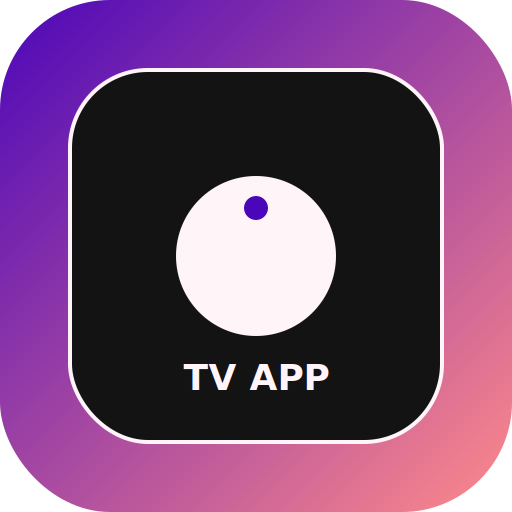
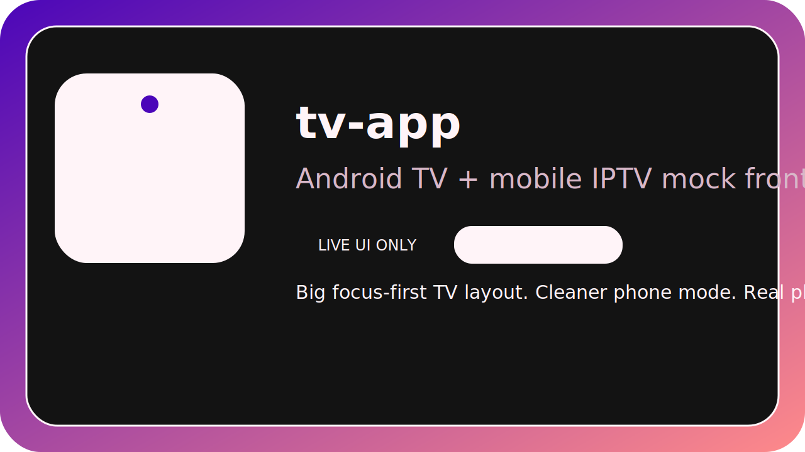
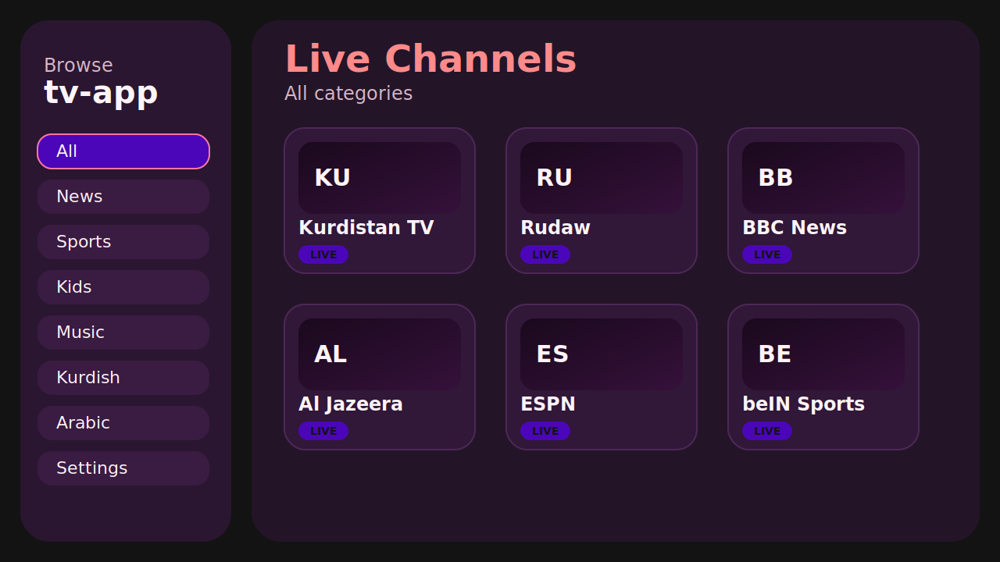
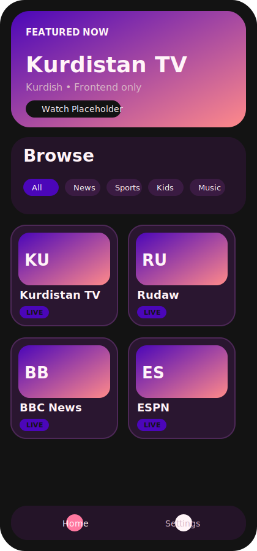
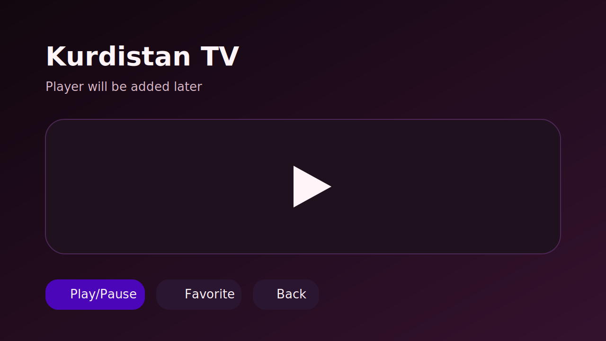

# tv-app

[](https://github.com/hevarrwandzi/tv-app/actions/workflows/android-debug.yml)
[](https://github.com/hevarrwandzi/tv-app/actions/workflows/android-release.yml)

Frontend-only IPTV UI for Android TV and Android phone, built with Kotlin + Jetpack Compose.

Status:
- mock UI only
- no backend
- no real IPTV streams
- no payment
- no movie catalog

## Branding

<p align="center">
  
</p>

<p align="center">
  
</p>

The repo now includes real source branding assets:
- `branding/app-icon.svg`
- `branding/tv-banner.svg`
- PNG launcher assets wired into the Android manifest for the app icon and TV banner

## Screenshots

### TV home


### Mobile home


### Player placeholder


## Highlights

- Dual-mode frontend
  - TV mode: large focus-first layout, left sidebar, D-pad friendly cards
  - Mobile mode: bottom navigation, featured hero section, cleaner cards
- Splash screen with auto-navigation after 2 seconds
- Category filtering with fake/mock channels only
- Player placeholder screen ready for future Media3 integration
- Settings placeholder screen
- Android TV banner + custom branding assets
- Compose previews for TV and mobile screens
- MVVM-style structure with fake repository and simple navigation

## Tech stack

- Kotlin
- Android Gradle Plugin
- Jetpack Compose
- Compose Navigation
- Compose for TV Material
- Compose Material 3
- Media3 ExoPlayer

## Build

Verified on Linux with:

```bash
./gradlew assembleDebug
```

Expected result:

```text
BUILD SUCCESSFUL
```

APK output:

```text
app/build/outputs/apk/debug/app-debug.apk
```

## Open in Android Studio

1. Start Android Studio
2. Open the `tv-app` folder
3. Let Gradle sync finish
4. Build with `assembleDebug` or the IDE build button
5. For previews, open:
   - `app/src/main/java/com/hevar/tvapp/ui/PreviewGallery.kt`
   - `app/src/main/java/com/hevar/tvapp/ui/home/HomeScreen.kt`

## GitHub Actions

This repo includes two workflows:
- `.github/workflows/android-debug.yml`
- `.github/workflows/android-release.yml`

`android-debug.yml`
- runs on every push to `main`, pull request, or manual trigger
- builds with `./gradlew assembleDebug`
- uploads `app-debug.apk` as a workflow artifact

`android-release.yml`
- runs automatically when you push a tag like `v1.0.0`
- can also run manually from the Actions tab with a chosen tag name
- builds `app-debug.apk`
- creates or updates a GitHub Release and attaches the APK

Example release flow:

```bash
git tag v1.0.0
git push origin v1.0.0
```

## Project structure

```text
tv-app/
├── .github/
│   └── workflows/
│       ├── android-debug.yml
│       └── android-release.yml
├── app/
│   ├── build.gradle.kts
│   └── src/main/
│       ├── AndroidManifest.xml
│       ├── java/com/hevar/tvapp/
│       │   ├── data/
│       │   ├── model/
│       │   ├── navigation/
│       │   ├── theme/
│       │   └── ui/
│       │       ├── home/
│       │       ├── player/
│       │       ├── settings/
│       │       └── splash/
│       └── res/
│           ├── drawable/
│           └── drawable-nodpi/
├── branding/
├── docs/
│   └── assets/
├── gradle/
├── build.gradle.kts
├── gradle.properties
├── settings.gradle.kts
└── README.md
```

## Notes

- Fake repository only: `FakeChannelRepository`
- Real playback intentionally not implemented yet
- Local SDK paths are not committed
- `local.properties` stays local and is ignored by Git
- Emulator testing is not required right now because your current setup has ADB/KVM issues
- The project is ready for GitHub collaboration, CI, and tagged APK releases
